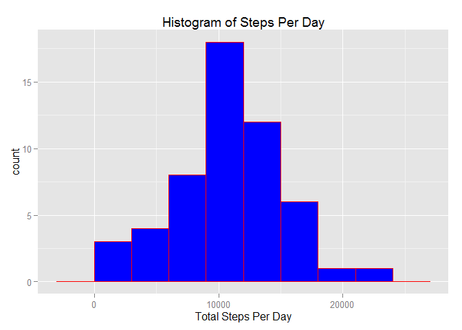
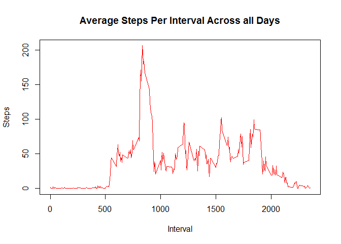
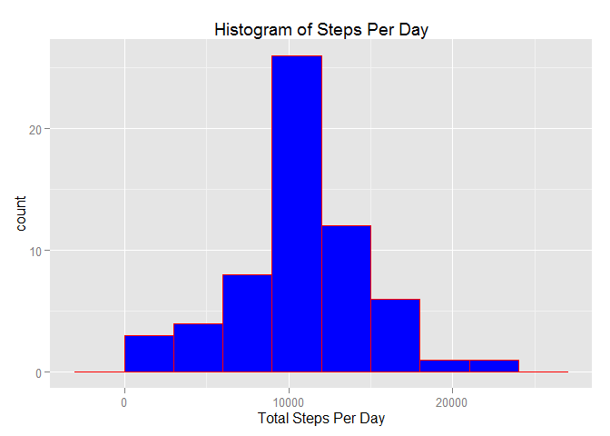
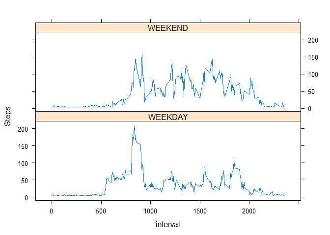

# Reproducible Research: Peer Assessment 1

# Overview

This is project 1 of the Reproducible Research class. The goal of the project is to analyze the data from an activity monitor and answer a set of questions. R markdown will be used to perform literate statistical programming. Both the discussion of the project and the code with the results will be weaved together in this Rmd file.

## Setup path and libraries needed for project.
Note: Make sure you change the path for your computer.


```r
setwd("C:/Users/Tim/OneDrive/Documents/Coursera/DataScienceSpecialization/ReproducibleResearch/Projects/RepData_PeerAssessment1")
library(knitr)
library(dplyr)
```

```
## 
## Attaching package: 'dplyr'
## 
## The following objects are masked from 'package:stats':
## 
##     filter, lag
## 
## The following objects are masked from 'package:base':
## 
##     intersect, setdiff, setequal, union
```

```r
library(ggplot2)
library(chron)
library(lattice)
opts_chunk$set(echo=TRUE)   # Always echo commands
```

## Loading and preprocessing the data

Convert the 'date' to date format and steps to numeric.

```r
df = read.csv("activity/activity.csv")
df[,"date"] = as.Date(df[,"date"],"%Y-%m-%d")
df[,"steps"] = as.numeric(df[,"steps"])
```

## What is mean total number of steps taken per day?

Determine the total steps taken per day.

```r
df1 = df %>%
  group_by(date) %>%
  summarize(stepsPerDay = sum(steps))
```

Create a histogram using ggplot


```r
qplot(df1$stepsPerDay,
      geom="histogram",
      main = "Histogram of Steps Per Day", 
      xlab = "Total Steps Per Day",  
      binwidth = 3000,
      fill=I("blue"), 
      col=I("red")) 
```

 

The mean number of steps per day.

```r
mean(df1$stepsPerDay,na.rm=TRUE)
```

```
## [1] 10766.19
```

The median number of steps per day.

```r
median(df1$stepsPerDay,na.rm = TRUE)
```

```
## [1] 10765
```
## What is the average daily activity pattern?

The following plot tracks the average number of steps per 5 minute interval for each day. NAs are ommitted.

1. First compute the average steps per 5 minute interval grouped by day.
2. Plot the Date on the x-axis and average steps per interval on y-axis.


```r
df2 = df %>%
  na.omit() %>%
  group_by(interval) %>%
  summarize(avgStepsPerInt = mean(steps))
  
plot(df2$interval,df2$avgStepsPerInt,type="l",
     xlab="Interval",
     ylab="Steps",
     col="red",
     main = "Average Steps Per Interval Across all Days")
```

 

Determine the interval with the maximum number of steps.

```r
max(df2$avgStepsPerInt)
```

```
## [1] 206.1698
```

```r
df2[which.max(df2$avgStepsPerInt),"interval"]
```

```
## Source: local data frame [1 x 1]
## 
##   interval
##      (int)
## 1      835
```

Interval 835 averages over 206 steps.

## Imputing missing values

Imputation is done by filling in the NA values with the average steps per interval.


```r
sum(is.na(df$steps))
```

```
## [1] 2304
```

```r
df3 = df %>%
  group_by(date) %>%
  mutate(avgStepsPerInt = mean(steps)) %>%
  mutate(steps = ifelse(is.na(steps), 
                     ifelse(is.na(avgStepsPerInt),mean(df2$avgStepsPerInt),
                            avgStepsPerInt),steps))
```
Create a histogram of imputed data using ggplot


```r
df1 = df3 %>%
  group_by(date) %>%
  summarize(stepsPerDay = sum(steps))

qplot(df1$stepsPerDay,
      geom="histogram",
      main = "Histogram of Steps Per Day", 
      xlab = "Total Steps Per Day",
      binwidth = 3000,
      fill=I("blue"), 
      col=I("red")) 
```

 

The mean number of steps per day.

```r
mean(df1$stepsPerDay,na.rm=TRUE)
```

```
## [1] 10766.19
```

The median number of steps per day.

```r
median(df1$stepsPerDay,na.rm = TRUE)
```

```
## [1] 10766.19
```

The results of imputing the data changes the median from 10765 to 10766.19 which is the mean. The mean remained the same after imputing the data. The median changed because the total number of steps were increased. The mean remained the same because the NAs were replaced by the mean interval per day.

## Are there differences in activity patterns between weekdays and weekends?

Create a new factor variable showing weekday or weekend.

```r
mx = which.max(df3$interval)
df4 = df3 %>%
  mutate(weekday = ifelse(is.weekend(date), "WEEKEND", "WEEKDAY")) %>%
  group_by(interval,weekday) %>%
  summarize(avgStepsPerInt = mean(steps))

#df4 = df4[1:mx,]

xyplot(avgStepsPerInt ~ interval | weekday,
       data = df4,
       type = "l",
       layout=c(1,2),
       ylab = "Steps")
```

 
